# System Architecture

## 🌟 Philosophy: The "Hyper-Flexible" Platform

`yql` is not just a hardcoded HR app. It is an **Engine-Driven Platform** designed to adapt.
Instead of writing 50 different "Forms" for Recruitment, Leave, Onboarding, etc., we built **One Engine** that can run *any* process defined by an Admin.

**Key Principle**: *Code the tool builder, not the tool.*

### 🧠 The "Engine-First" Ethos

To maintain this flexibility, future developers must adhere to this decision framework:

> **The Golden Rule**: As you build features, rigorously ask: *"Can I do this by just configuring a Program?"* Only write code if the answer is strictly **No**.

#### Decision Matrix
| Requirement | Approach | Why? |
| :--- | :--- | :--- |
| **"We need a new Onboarding Flow with 5 steps"** | ✅ **Configure** | The Engine already handles stages, inputs, and transitions. |
| **"We need to send an email when X happens"** | ✅ **Configure** | Use the `AutomationDesigner` to hook into the event bus. |
| **"We need a totally new way to visualize the Org Chart"** | 🛠️ **Code** | The current Engine UI doesn't support custom visualizations. |
| **"We need a new input type (e.g. Signature Pad)"** | 🛠️ **Extend Engine** | Build a new `Block` component, then **Configure** it in the program. |

**Resist the urge to hardcode.** Hardcoding solves the problem *today* but breaks the platform *tomorrow*.

---

## 🏗 Tech Stack

-   **Backend**: [Convex](https://convex.dev) - Real-time Database & Backend-as-a-Service (BaaS).
-   **Frontend**: React + Vite + TypeScript.
-   **Styling**: TailwindCSS.
-   **State**: Convex (Server State), React Context (Local Auth).

---

## 📂 Two-Layer Architecture

The codebase is strictly organized into two distinct layers. This structure is mirrored in `src/` (Frontend) and `convex/` (Backend).


### 1. Core (`/core`)
**The Foundation.** Platform-agnostic utilities shared by everyone.
-   **Auth**: Identity & Basic Guards (`auth.ts`).
-   **Access Control**: Granular Permissions & RBAC (`accessControl.ts`).
-   **Constants**: System roles, HR statuses, role hierarchy (`constants.ts`).
-   **Middleware**: Rate limiting and auth wrappers (`middleware.ts`).
-   **Audit**: `createAuditLog` (Legal trail for everything).
-   **UI**: Generic components (`Button`, `Card`, `Modal`).

### 2. Engine (`/engine`)
**The Workflow Machine.** The generic logic that powers 100% of the app.
-   **Programs (`programs.ts`)**: Configuration "Classes" (e.g., "Onboarding 2026").
-   **Processes (`processes.ts`)**: State "Instances" (e.g., "Jane's Onboarding").
-   **Automations (`automations.ts`)**: The Event Bus.
-   **Blocks**: `InputText`, `FileUpload`, `Signature` logic.
-   **Access**: Process-level permission logic (`access.ts`).

---

## ⚙️ The Process Engine Model

Understanding this model is critical for working on the backend.

### The Hierarchy
1.  **Program**: The configuration object. Contains `StageDefs` and `Automations`.
2.  **Process**: The runtime object. Linked to ONE User and ONE Program.
3.  **Stage**: A step in the Process. Contains `BlockInstances`.
4.  **Block**: An atomic unit of UI/Data (e.g., "Grades Upload").

### Data Flow Example: "Applying for a Job"
1.  **User** submits data to `submitStage` mutation.
2.  **Engine** validates data against `BlockConfig`.
3.  **Engine** calculates `nextStageId`.
4.  **Engine** emits an event: `stage_submission`.
5.  **Automation Engine** catches event -> Runs Actions (e.g., "Send Email").

---

## ⚡ Automations Architecture (Event-Driven)

We moved away from hardcoded "Side Effects" (e.g., `if (accepted) user.role = member`) to a data-driven model.

### How it works
1.  **Trigger**: A Mutation (like `acceptOffer` or `bookEvent`) emits a trigger string (e.g., `offer_accepted`).
2.  **Evaluate**: `automations.evaluate` (internal action) is scheduled.
3.  **Config Lookup**: It looks at the `Program.automations` array.
4.  **Execution**: matching Actions are executed.

**Supported Triggers**:
-   `process_created`
-   `stage_submission`
-   `status_change`
-   `offer_accepted`
-   `event_booked`

**Supported Actions**:
-   `update_role`
-   `update_status`
-   `send_email`

---

## 🔒 Unified Access Control System

Security is handled through a **centralized three-tier model** with a clear priority cascade.

### Access Check Priority Cascade

When checking access, the system follows this order:

```mermaid
flowchart TD
    Start[Access Request] --> A{1. Authenticated?}
    A -->|No| Deny[❌ DENY]
    A -->|Yes| B{2. HR_STATUS = blocked?}
    B -->|Yes| Deny
    B -->|No| C{3. Is Admin?}
    C -->|Yes| Allow[✅ ALLOW]
    C -->|No| D{4. minimumRole check?}
    D -->|Fail| Deny
    D -->|Pass| E{5. allowedRoles check?}
    E -->|Fail| Deny
    E -->|Pass| F{6. specialRole check?}
    F -->|Fail| Deny
    F -->|Pass| G{7. Resource RBAC?}
    G -->|Deny| Deny
    G -->|Allow| Allow
```



### The Three Tiers

#### 1. HR Status (`users.hrStatus`)
*Lifecycle status that determines if user can access the system at all.*

| Status | Description |
| :--- | :--- |
| `candidate` | Applicant, limited access |
| `active` | Full member, standard access |
| `alumni` | Former member, read-only |
| `blocked` | Suspended, no access |

**Implementation**: `isBlockedStatus()`, `isActiveStatus()` in `core/constants.ts`.

#### 2. System Role (`users.systemRole`)
*Global permission level with hierarchy.*

| Role | Level | Description |
| :--- | :---: | :--- |
| `guest` | 0 | Applicant/Public |
| `member` | 10 | Standard active member |
| `manager` | 20 | Operational lead (Squad Lead) |
| `lead` | 30 | Strategic lead (Dept Head) |
| `admin` | 100 | System owner (God mode) |

**Implementation**: `ROLE_HIERARCHY`, `hasMinimumRole()`, `isStaffRole()`, `isAdmin()` in `core/constants.ts`.

#### 3. Special Roles (`special_roles` table)
*Additive permissions for granular features.*

| Example | Purpose |
| :--- | :--- |
| `recruiter` | Can access recruitment tools |
| `finance_admin` | Can approve expense reports |

**Implementation**: `hasSpecialRole()`, `getUserSpecialRoles()` in `core/accessControl.ts`.

### Key Files

| File | Purpose |
| :--- | :--- |
| `core/constants.ts` | `HR_STATUSES`, `SYSTEM_ROLES`, `ROLE_HIERARCHY`, helper functions |
| `core/accessControl.ts` | `checkAccess()`, `requireAccess()`, centralized access service |
| `core/auth.ts` | `getViewer()`, `ensureAdmin()`, `ensureReviewer()` |
| `core/middleware.ts` | `mutationWithAuth()` with minimumRole, requireActive support |

### Usage Patterns

**Backend - Quick Checks:**
```typescript
import { isAdmin, isStaffRole, hasMinimumRole } from "./constants";

if (isAdmin(user.systemRole)) { /* Admin bypass */ }
if (isStaffRole(user.systemRole)) { /* Manager+ */ }
if (hasMinimumRole(user.systemRole, SYSTEM_ROLES.MANAGER)) { /* At least manager */ }
```

**Backend - Full Access Check:**
```typescript
import { checkAccess } from "./accessControl";

const result = await checkAccess(ctx, {
    minimumRole: "manager",
    requireActive: true,
});
if (!result.allowed) throw new Error(result.reason);
```

**Frontend - Route Protection:**
```tsx
<RoleGuard minimumRole="manager" requireActive>
    <StaffOnlyPage />
</RoleGuard>
```

### Context-Level Access (Program/Entity Specific)

Beyond system-wide RBAC, individual entities define their own access:

| Entity | Field | Purpose |
| :--- | :--- | :--- |
| `programs` | `accessControl` | Role-based actions and department scoping |
| `stages` | `roleAccess` | Per-stage visibility/submission rights |
| `block_instances` | `roleAccess` | Per-block view/edit permissions |
| `dashboards` | `roleAccess` | Dashboard visibility by role |

---

## 👩‍💻 Developer Guide: "Where do I put my code?"

| Scenario | Location | Example |
| :--- | :--- | :--- |
| **"I need a reusable React Button"** | `src/core/ui` | `Button.tsx` |
| **"I need a new type of form field"** | `src/engine/blocks` | `AudioRecorder.tsx` |
| **"I need to query all Users"** | `convex/core/users.ts` | `getAllUsers` |
| **"I need to fix the Application Logic"** | `convex/engine/processes.ts` | `submitStage` |
| **"I need to add a role check"** | `convex/core/constants.ts` | Use `isStaffRole()`, `hasMinimumRole()` |

### Adding a New Feature
1.  **Can the Engine do it?** (Can I just configure a Program?) -> **Do that.**
2.  **Can the Engine almost do it?** (Do I need a new Block type?) -> **Extend Engine.**

### Adding Access Control
1.  **Never use inline role arrays** like `['admin', 'manager'].includes(...)`.
2.  **Use helper functions**: `isAdmin()`, `isStaffRole()`, `hasMinimumRole()`.
3.  **For complex checks**: Use `checkAccess()` from `accessControl.ts`.

---

## 🚦 Current Implementation Status (Feb 2026)

### ✅ What is Working
-   **Generic Engine**: `programs.ts` and `processes.ts` fully support the "Configuration over Code" philosophy.
-   **Dynamic Data**: `v.any()` allows for flexible form inputs and stage configurations.
-   **Automations**: Event-driven model (`trigger` -> `action`) is implemented in `automations.ts` and triggered via `ctx.scheduler`.
-   **Unified Access Control**: Centralized three-tier access model (HR Status + System Role + Special Roles) with priority cascade.
-   **Role Hierarchy**: `hasMinimumRole()` enables "manager or above" style checks.
-   **HR Status Enforcement**: Blocked users are rejected at the access control layer.
-   **Standardized Process Statuses**: Unified `PROCESS_STATUS` constants prevent magic string errors across the engine.
-   **Basic Security**: `accessGate.ts` prevents brute force on specific blocks (timing-safe comparisons).

### ⚠️ Known Gaps & Risks

#### 1. Flexibility
-   **Validation Weakness**: `submitStage` uses a generic `z.any()` schema. While `validateStageSubmission` checks `requiredFields`, it lacks deep type enforcement or recursive object validation.
-   **Routing Logic**: `calculateNextStage` supports basic "If Field == Value" logic but lacks complex Boolean operators (AND/OR) or multi-field dependencies.

#### 2. Infrastructure & Scalability
-   **Pagination Hazard**: `getProcessesPaginated` uses `requiredRoleLevel` index for efficient filtering, but complex visibility rules may still require optimization for 10k+ records.
-   **Config Management**: There is no version control for component/JSON configurations. If a Program's config structure changes, existing Processes may break.

#### 3. Security (Resolved)
-   **Rate Limiting**: Currently using `requireRateLimit` and `mutationWithAuth` wrapper for protected mutations.

---

## 📚 Quick Reference

### Role Helpers (`core/constants.ts`)

```typescript
// Check if admin
isAdmin(role)                           // role === 'admin'

// Check if staff (manager+)  
isStaffRole(role)                       // manager, lead, or admin

// Check hierarchy
hasMinimumRole(role, SYSTEM_ROLES.MANAGER)  // role >= manager

// Get numeric level
getRoleLevel(role)                      // For DB indexing
```

### HR Status Helpers (`core/constants.ts`)

```typescript
isBlockedStatus(status)   // status === 'blocked'
isActiveStatus(status)    // status === 'active'
```

### Access Control (`core/accessControl.ts`)

```typescript
// Full check with cascade
const result = await checkAccess(ctx, {
    minimumRole: "manager",     // Hierarchy check
    allowedRoles: ["admin"],    // Exact match (OR with minimumRole)
    requireActive: true,        // Require active HR status
    resource: "files",          // For resource-level RBAC
    action: "delete",
});

// Convenience wrappers
await requireAccess(ctx, options);      // Throws if denied
await requireStaffAccess(ctx);          // Manager+
await requireAdminAccess(ctx);          // Admin only
```
